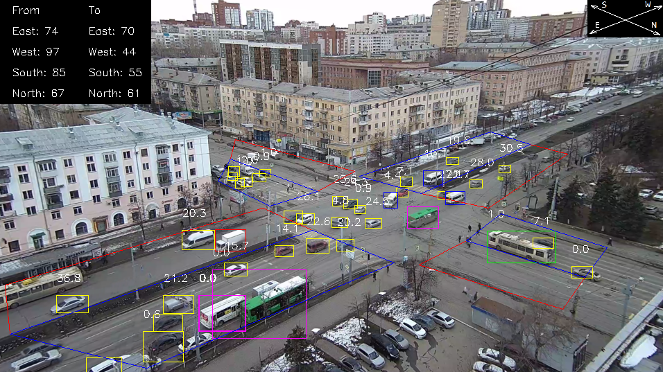

## Traffic Monitoring

This repository contains source codes for the program, which implements methods for calculating traffic parameters described in the research work "Real-time monitoring of traffic parameters." This program counts vehicles in each of the four directions of movement and calculates the speed of vehicles by the method of prospective conversion.
Here is an example of how the system works.

This source code should not be considered as a completed implementation. It is just an example of how modern solutions can be applied in the convolutional neural networks, together with the methods presented in work.
